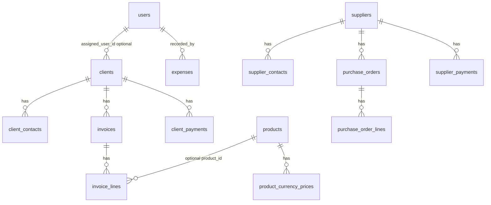

# نظرة شاملة على النظام — بروفايل ميدا

> **الغرض:** وصف **الحالة الفعلية للتطبيق** (مسارات، نماذج، تجميعات لوحة التحكم، سياسات) لمرجع الفريق دون تكرار مواصفة المفاهيم بالكامل؛ للتفاصيل المنطقية للجداول راجع `docs/03_DATABASE_SPEC.md`. للمصفوفة التقريرية راجع `docs/04_REPORTS_AND_UI_MATRIX.md`.

---

## 1) المكدس والتشغيل

| الطبقة | التقنية |
|--------|---------|
| الباكند | Laravel (PHP 8.2+)، Eloquent، مسارات `routes/web.php` + `routes/auth.php` |
| الواجهة | Blade + Livewire 3 + Alpine.js + Tailwind، اتجاه RTL وعربية في الواجهة |
| المصادقة | جلسة Laravel، حماية المسارات بـ `middleware(['auth'])` |

---

## 2) المستخدمون والأدوار

النموذج: `App\Models\User` — الحقول تشمل `role` و`is_active`.

| الدور (`role`) | المعنى التشغيلي |
|----------------|------------------|
| `manager` | أوسع صلاحيات؛ حذف كيانات حساسة حيث يُفرض في المسارات أو السياسات |
| `accountant` | إنشاء وتعديل المستندات المالية (فواتير، دفعات، مصروفات، منتجات، …) |
| `viewer` | عرض غالب الشاشات دون تعديل المستندات المحمية بـ `isAccountant()` |

**دوال مساعدة في `User`:**

- `isAccountant()`: يعيد `true` لـ **المحاسب والمدير** (يُستخدَم لإنشاء/تعديل الفواتير وغيرها).
- `isManager()`: **المدير فقط** (حذف عملاء، مصروفات، دفعات، موردين، … حسب المسار).
- `isViewer()`: المشاهد فقط.

---

## 3) خريطة المسارات (واجهات الإنتاج)

جميع المسارات أدناه (عدا `/login`) داخل مجموعة `auth`.

| المسار (أمثلة) | الاسم (`route()`) | ملاحظات صلاحية |
|------------------|-------------------|------------------|
| `/` | إعادة توجيه إلى `dashboard` | — |
| `/dashboard` | `dashboard` | لوحة + **ملخص مالي حسب العملة** (قسم مطوي؛ نفس المنطق في جزئيات مشتركة) |
| `/financial-summary` | `financial-summary` | **صفحة مستقلة** لصناديق العملات (عرض دائم للمجاميع حسب العملة) |
| `/clients` … | `clients.*` | إنشاء/تعديل: محاسب؛ حذف: مدير؛ كشف/PDF: سياسة العميل |
| `/invoices` … | `invoices.*` | إنشاء/تعديل: محاسب؛ طباعة: مسار عام ضمن `auth` |
| `/payments` … | `payments.*` | إنشاء/تعديل: محاسب؛ حذف: مدير |
| `/products` … | `products.*` | سياسة `Product` (إنشاء/تعديل محاسب؛ حذف مدير) |
| `/expenses` … | `expenses.*` | إنشاء/تعديل: محاسب؛ حذف: مدير |
| `/suppliers` … | `suppliers.*` | إنشاء/تعديل: محاسب؛ حذف: مدير |
| `/purchase-orders` … | `purchase-orders.*` | سياسة `PurchaseOrder` + محاسب للنماذج |
| `/supplier-payments` … | `supplier-payments.*` | إنشاء/تعديل: محاسب؛ حذف: مدير |
| `/reports/client-receivables-aging` | `reports.client-receivables-aging` | `Gate`: عرض لأي مستخدم نشط؛ تصدير CSV للمحاسب/المدير |
| `/legacy-catalog/products` | `legacy-catalog-products.index` | سياسة `LegacyCatalogProduct`؛ **مسار حي** قد لا يظهر في القائمة الجانبية |
| `/income-entries` … | `income-entries.*` | **إعادة توجيه** إلى `payments.index` مع تنبيه (الإيراد النقدي عبر دفعات العملاء فقط) |
| `/users` … | `users.*` | **المدير فقط** |

---

## 4) مكوّنات Livewire (ربط العرض)

| الشاشة | المكوّن |
|--------|---------|
| عملاء | `client-list`, `client-form` |
| فواتير | `invoice-list`, `invoice-form` |
| دفعات عملاء | `payment-list`, `payment-form` |
| منتجات مبيعات | `product-list`, `product-form` |
| مصروفات | `expense-list`, `expense-form` |
| موردون | `supplier-list`, `supplier-form` |
| أوامر شراء | `purchase-order-list`, `purchase-order-form` |
| دفعات موردين | `supplier-payment-list`, `supplier-payment-form` |
| كشوف | `client-statement`, `supplier-statement` |
| تقرير ذمم | `client-receivables-aging-report` |
| أرشيف كتالوج | `product-catalog-list` |
| مستخدمون | `user-list`, `user-form` |

> ملفات العرض تحت `resources/views/` تستدعي المكوّنات أعلاه؛ لوحة التحكم `resources/views/dashboard.blade.php` **ليست** Livewire بل Blade مع `@php` لتجميع أرقام البطاقات العلوية، وتستدعي جزئية `partials/currency-boxes-full` للملخص المالي (مطوي) كما في `financial-summary.blade.php`.

---

## 5) الجداول والعلاقات (ملخص تنفيذي)

- **العملاء:** `clients` ← `client_contacts`
- **الموردون:** `suppliers` ← `supplier_contacts`
- **المبيعات:** `invoices` ← `invoice_lines` (حقل اختياري `product_id` → `products`)
- **المنتجات:** `products` ← `product_currency_prices` (تسعير لكل عملة مدعومة)
- **التحصيل:** `client_payments` → `clients`
- **المشتريات:** `purchase_orders` ← `purchase_order_lines` → `suppliers`
- **دفعات الموردين:** `supplier_payments` → `suppliers`
- **اليومية:** `expenses` (مع `recorded_by_user_id` → `users`)؛ جدول `income_entries` قد يبقى في المخطط لكن **واجهة المسارات الحالية** تدمج الإدخال مع دفعات العملاء
- **أرشيف:** `legacy_catalog_products` (قراءة/بحث؛ ترحيل إلى `products` عبر أمر Artisan)
- **هوية:** `users`

### مخطط علاقات (Mermaid — مبسّط)

---

## 6) لوحة التحكم والملخص المالي «حسب العملة»

**الملفات:**

- `resources/views/dashboard.blade.php` — لوحة التحكم؛ تعرض الملخص داخل قسم **مطوي** (Alpine) عبر `@include('partials.currency-boxes-full')`.
- `resources/views/financial-summary.blade.php` — **صفحة «صناديق العملات»** وحدها؛ نفس الجزئية معروضة دائمًا.
- `resources/views/partials/currency-boxes-full.blade.php` — استعلامات التجميع حسب العملة + بطاقات الصناديق في ملف واحد (لتفادي نطاق متغيرات Blade بين `@include` متعددة).

**سلوك العرض في لوحة التحكم:** قسم «الملخص المالي» **مخفي افتراضيًا** (Alpine `open: false`) حتى يضغط المستخدم «إظهار الأرقام»؛ يوجد رابط نصي «صفحة صناديق العملات» يوجّه إلى المسار `financial-summary`.

**من القائمة الجانبية:** بند **«صناديق العملات»** يفتح `/financial-summary` (صفحة مستقلة).

**بناء قائمة العملات (`$finCurrencies`):** اتحاد مفاتيح العملة الناتجة عن التجميعات الخمسة أدناه (ثم فرز وفريد).

| المتغير | المصدر | شرط الحالة |
|---------|--------|-------------|
| `$invoicedByC` | `Invoice` | `status = issued` فقط؛ `sum(total_amount)` لكل `currency_code` |
| `$paidByC` | `ClientPayment` | مجموع `amount` لكل عملة |
| `$expenseByC` | `Expense` | مجموع `amount` لكل عملة |
| `$poSupByC` | `PurchaseOrder` | `status = issued` و`deleted_at` فارغ؛ مجموع `total_amount` |
| `$paidSupByC` | `SupplierPayment` | `deleted_at` فارغ؛ مجموع `amount` |

**مؤشرات داخل كل بطاقة عملة:**

- **رصيد مستحق من العملاء:** `إجمالي فواتير صادرة − دفعات العملاء` (نفس العملة).
- **صافي (دفعات العملاء − مصروفات):** تفسير تشغيلي مبسّط وليس بالضرورة «رصيد خزينة» محاسبي كامل.
- **التزام تجاه الموردين:** `أوامر شراء صادرة − دفعات الموردين` (نفس العملة).

**مهم:** لا تُحتسب فواتير **`draft`** أو **`void`** في تجميع الملخص المالي أعلاه.

---

## 7) السياسات (Policies) والبوابات (Gates)

**التسجيل:** `App\Providers\AppServiceProvider::boot()`

| النموذج | السياسة |
|---------|---------|
| `Client` | `ClientPolicy` |
| `ClientPayment` | `ClientPaymentPolicy` |
| `Invoice` | `InvoicePolicy` |
| `Product` | `ProductPolicy` |
| `PurchaseOrder` | `PurchaseOrderPolicy` |
| `Supplier` | `SupplierPolicy` |
| `SupplierPayment` | `SupplierPaymentPolicy` |
| `LegacyCatalogProduct` | `LegacyCatalogProductPolicy` |

**Gates مخصّصة:**

- `view-client-receivables-aging`: أي مستخدم نشط.
- `export-client-receivables-aging-csv`: `isAccountant()` (محاسب + مدير).

**ملاحظة هندسية:** جزء من الحماية في **`routes/web.php`** عبر `abort_unless(auth()->user()->isAccountant())` وغيره، وجزء في **Policies**. أي تغيير لاحق في الصلاحيات يجب أن يراجع **المسارين** معًا.

---

## 8) ترحيل كتالوج قديم → منتجات مبيعات

**الأمر:** `php artisan catalog:migrate-legacy-products`

**الملف:** `app/Console/Commands/MigrateLegacyCatalogProductsCommand.php`

- يقرأ من `legacy_catalog_products` وينشئ `products` + `product_currency_prices` حيث ينطبق.
- يمنع التكرار عبر `products.imported_from_legacy_catalog_id` (فريد).
- إعادة التشغيل آمنة للسجلات المرتبطة بالفعل.

---

## 9) فجوات مقصودة / مخاطر تشغيلية

1. **لا يوجد** جدول «خزينة» أو يومية نقدية مفصّلة — الموجود تجميعات في لوحة التحكم + شاشات المصدر.
2. **ازدواجية قواعد الصلاحية** بين الراوتر والسياسات (انظر القسم 7).
3. **منطق مالي في الـ View** للوحة التحكم: سريع للتشغيل، لكنه أصعب للاختبار؛ مرشح لاحقًا لخدمة أو View Model واختبارات.
4. **`Expense`:** لا سياسة مسجّلة في `AppServiceProvider`؛ الاعتماد على شروط المسارات للحذف/التعديل.
5. **متعدد العملات:** الملخص لا يجمع عملات مختلفة في رقم واحد — يتوافق مع مبدأ عدم الجمع العبري في الدستور.

---

## 10) مراجع داخلية

| الملف | الموضوع |
|-------|---------|
| `docs/03_DATABASE_SPEC.md` | مواصفة منطقية للجداول |
| `docs/04_REPORTS_AND_UI_MATRIX.md` | مصفوفة تقارير ومستقبل واجهات |
| `docs/decisions/ADR-001-backend-laravel-frontend-stack.md` | المكدس المعتمد |
| `.cursorrules` | دستور المشروع والقيود |

---

*آخر مراجعة توثيقية للكود: 2026-05-12.*
